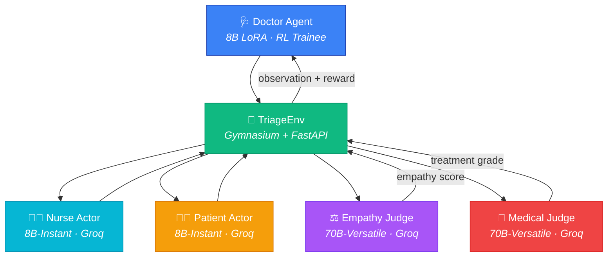

<div align="center">

# 🏥 Conversational Health Care Agents

### *ER-MAP: Emergency Response Multi-Agent Pipeline*

**An RL environment where an 8B Doctor agent learns to diagnose, communicate, and treat — by interacting with LLM-driven patients and nurses in a chaotic ER simulation.**

[](https://pytorch.org/blog/openenv/)
[](LICENSE)
[](https://python.org)
[](https://groq.com)
[](https://gymnasium.farama.org/)


[📺 Demo Video](https://www.youtube.com/watch?v=hL7n5TU7Bm4) · [📖 Engineering Blog](./blog.md) · [🤗 Live HF Space](https://huggingface.co/spaces/garv1garv/Conversational-Health-Care-Agents)

</div>

---

## 💡 Why This Exists

Most medical-LLM benchmarks ask a frozen model to one-shot a multiple-choice question. **Real emergency medicine is nothing like that.**

A doctor has to *steer a workflow*: review prior history, get vitals from a nurse who might be overwhelmed, decide which of forty labs is worth ordering, document a working diagnosis before treating, and earn consent from a patient who may walk out against medical advice.

> **We target process-level clinical competence under uncertainty** — the ability to make a sequence of tool-use decisions with imperfect information, while balancing diagnostic accuracy, time, cost, and patient trust.

This needs an **environment**, not a benchmark. It needs **dense, multi-component, hack-resistant rewards**, not a single accuracy score.

---

## 🏗️ Architecture

A multi-agent Gymnasium environment served via FastAPI (OpenEnv-compatible) with a **Quad-Agent Architecture**:



### The Agents

| Agent | Role | Model | Key Behavior |
|:---|:---|:---|:---|
| 🩺 **Doctor** | RL Trainee | 8B LoRA (Unsloth) | Explores tools, diagnoses, prescribes |
| 👩‍⚕️ **Nurse** | Cooperative Colleague | 8B-Instant (Groq) | Executes orders, reports vitals, triages |
| 🧑‍🦽 **Patient** | Adversarial Actor | 8B-Instant (Groq) | Hidden trust/anxiety state — can refuse treatment or leave AMA |
| ⚖️ **Empathy Judge** | Per-Message Evaluator | 70B-Versatile (Groq) | Grades the Doctor's communication tone in real-time |
| 🔬 **Medical Judge** | Terminal Evaluator | 70B-Versatile (Groq) | Grades treatment accuracy, flags lethal prescriptions |

---

## 🎲 Domain Randomization

Every episode is unique. No two patients are alike.

| Dimension | Scale | Details |
|:---|:---|:---|
| 🦠 **Diseases** | 50 across 10 classes | Cardiovascular, Neuro, Trauma, Toxicology, Endocrine, GI, Respiratory, Infectious, Immunologic, Environmental |
| 🎭 **Persona Combos** | 77,760+ unique | 5 Patient axes × 4 Nurse axes × 50 diseases |
| 📊 **Difficulty Tiers** | 3 phases | Phase-aware SOAP noise injection & patient hostility |
| 🚨 **Emergency Flags** | 16 time-critical | Diseases marked for emergency identification scoring |

### 🔊 ElevenLabs Emotion TTS
A TTS adapter injects emotion tags (`[sigh]`, `[nervous]`, `[hostile]`) based on the Patient's hidden emotional state, producing expressive real-time audio during the dashboard demo.

---

## 🛠️ Doctor's Toolkit

The Doctor gets **five strict JSON tools**. Everything else is hidden: the true disease, lethal-treatment list, patient trust/anxiety scores, and the milestone tracker.

```json
{"tool": "read_soap",           "section": "ALL"}
{"tool": "speak_to",            "target": "patient", "message": "..."}
{"tool": "speak_to",            "target": "nurse",   "message": "..."}
{"tool": "order_lab",           "test_name": "troponin"}
{"tool": "update_soap",         "section": "Assessment", "content": "..."}
{"tool": "terminal_discharge",  "treatment": "...", "is_emergency": true}
```

**Clinical Constraints:**
- 🔒 **Consent Lock** — Treatment blocked without patient consent (Phase 2+)
- 📋 **Workflow Milestones** — Expected: `READ_SOAP → PATIENT_CONTACT → VITALS → LABS → ASSESSMENT → DISCHARGE`
- 🚨 **Emergency Classification** — Doctor must flag time-critical cases or face penalties

---

## 📈 3-Phase Curriculum

Mirrors how real medical residents learn — from basics to chaos:

| Phase | Name | Difficulty | What the Doctor Must Learn |
|:---|:---|:---:|:---|
| **1** | 🔧 Tool Mastery | Easy | Read SOAP, talk to patient, order the critical lab, write Assessment + Plan, discharge correctly |
| **2** | 🧠 Clinical Reasoning | Medium | SOAP is noisy. Patient is anxious. Must do differential reasoning, not pattern-match |
| **3** | 💬 Empathetic Negotiation | Hard | Patient is hostile or non-compliant. Must earn trust or face AMA walkout penalties |

---

## ⚖️ 11-Component Reward Engine

> **Process > Terminal.** Process rewards (~60%) dominate terminal rewards (~40%). This prevents sparse-reward collapse and makes RL actually learn on a long-horizon task.

| Component | Range | What It Captures | Source |
|:---|:---|:---|:---|
| `process` | +0.05/step | JSON-validity, tool-legality | Rule |
| `milestones` | +0.03 to +0.07 | Ordered clinical workflow | Rule |
| `labs` | +0.20 / −0.20 | Critical vs redundant lab choice | Rule + DB |
| `diagnosis` | +0.20 / +0.30 | Assessment accuracy | Rule |
| `plan` | +0.15 / +0.25 | Plan accuracy | Rule |
| `documentation` | +0.08/step | SOAP completion | Rule |
| `empathy` | capped ±0.30 | Communication quality | **70B Empathy Judge** |
| `consent` | +0.25 / −0.50 | Patient agreement | Rule + Patient LLM |
| `emergency_id` | ±0.30 | Time-critical classification | Rule |
| `treatment` | −0.80 to +0.60 | Terminal clinical outcome | **70B Medical Judge** |
| `penalties` | −0.01 to −0.30 | Turn cost, invalid JSON, premature discharge | Rule |

### 🛡️ Anti-Reward-Hacking
1. **Dual-Verifier Treatment** — 70B Medical Judge + deterministic keyword verifier (60/40 blend)
2. **Empathy Farming Cap** — Hard-capped at +0.30/episode to prevent sycophantic exploitation
3. **Smooth Reward Gradients** — No +1/−1 cliff edges; smooth scaling for stable GRPO updates

---

## 📊 Training Results

Trained for **75 episodes** on a single **Kaggle T4** using **Unsloth 4-bit LoRA** + custom **manual GRPO**. Each episode ≈ 50-80 cross-actor LLM calls → **~5,000 LLM-mediated reward signals** total.

### Baseline (Untrained) → Trained


*Baseline: Untrained 8B model — zero win rate, high variance, near-zero empathy scores.*

| | Phase 1 | Phase 2 | Phase 3 |
|:---|:---:|:---:|:---:|
| **Trained** |  |  |  |

### Component-Level Improvement

| Component | Baseline | Trained | Δ |
|:---|:---:|:---:|:---:|
| **Process** | 0.42 | 0.85 | **+102%** |
| **Empathy** | −0.12 | 0.22 | **+283%** |
| **Labs** | 0.15 | 0.48 | **+220%** |
| **Diagnosis** | 0.05 | 0.35 | **+600%** |
| **Plan** | 0.02 | 0.28 | **+1300%** |
| **Documentation** | 0.10 | 0.45 | **+350%** |
| **Consent** | −0.30 | 0.15 | **+150%** |

---

## 🚀 Quick Start

### Prerequisites
- Python 3.9+
- A [Groq API key](https://console.groq.com/) (free tier works)

### Option 1 — Docker (Recommended)
```bash
docker build -t ermap .
docker run -p 7860:7860 -e GROQ_API_KEY="your_key" ermap
# Open http://localhost:7860/docs for Swagger UI
```

### Option 2 — Local Python
```bash
# Clone & install
git clone https://github.com/garv1garv/Conversational-Health-Care-Agents.git
cd Conversational-Health-Care-Agents
pip install -r requirements.txt

# Create .env file
echo "GROQ_API_KEY=your_key_here" > .env

# Run the OpenEnv server
uvicorn ER_MAP.server:app --host 0.0.0.0 --port 7860

# OR launch the interactive dashboard
python -m ER_MAP.dashboard
# Open http://localhost:5050
```

### Option 3 — Play as the Doctor (CLI)
```bash
python -m ER_MAP.play
# You make the clinical decisions. Can you save the patient?
```

### API Endpoints (OpenEnv)
```
POST /reset  → {observation, info}                              # Start episode
POST /step   → {observation, reward, done, truncated, info}     # Submit action
GET  /state  → full internal env state                          # Debug
GET  /health → {"status": "ok"}                                 # Liveness
GET  /docs   → Swagger UI                                       # Interactive docs
```

### Run Smoke Tests (No API Key Needed)
```bash
python -m ER_MAP.test_smoke
```

---

## 🔮 Roadmap

- **Ablation Runs** — Disable Empathy Judge or terminal-only rewards to prove necessity of process supervision
- **Wider LoRA (A100)** — Target `gate_proj`, `up_proj`, `down_proj` for 45M+ trainable params
- **Phase 4: Multi-Patient** — Shift handoffs + juggling two cases with a shared nurse
- **Extended Tool API** — `consult_specialist`, `image_order` (CT/X-ray), `pharmacy_check` (drug-allergy)

---

## 📁 Repository Structure

```
.
├── README.md                   # You are here
├── blog.md                     # Engineering deep dive
├── openenv.yaml                # OpenEnv deployment manifest
├── Dockerfile                  # HF Spaces / Docker deployment
├── requirements.txt            # Core dependencies
├── setup.py                    # pip install -e .[training]
│
├── ER_MAP/                     # Main package
│   ├── server.py               # FastAPI OpenEnv wrapper
│   ├── dashboard.py            # Interactive UI + TTS (God's-eye view)
│   ├── play.py                 # CLI: You Are The Doctor
│   ├── evaluate.py             # Evaluation harness + metrics
│   ├── evaluate_baseline.py    # Baseline comparison runner
│   ├── plotting.py             # Per-phase dashboard visualizations
│   ├── tts_engine.py           # ElevenLabs / Edge-TTS emotion adapter
│   ├── test_smoke.py           # Offline smoke tests (no API key)
│   │
│   ├── envs/                   # Core environment
│   │   ├── triage_env.py       # Gymnasium environment (1173 lines)
│   │   ├── disease_db.py       # 50-disease clinical database
│   │   ├── randomizer.py       # Persona & scenario generator
│   │   ├── empathy_engine.py   # Empathy Judge integration
│   │   ├── api_router.py       # Multi-key Groq routing + fallback
│   │   └── openenv_triage.py   # OpenEnv wrapper
│   │
│   └── training/
│       └── train_grpo.py       # Manual GRPO loop (Unsloth + LoRA)
│
├── baseline_eval/              # Baseline evaluation results + plots
├── training_perf*.png          # Per-phase training dashboards
└── kaggle/                     # Kaggle notebook builders
```

---

## 🙏 Acknowledgements

**Hugging Face** for credits and the Hub · **OpenEnv / PyTorch** team for a brilliantly designed hackathon brief · **Unsloth** for the 4-bit fused LoRA kernel that makes this fit on a T4 · **Groq** for the 8B and 70B inference APIs · **Kaggle** for free T4 GPU sessions · **ElevenLabs** for expressive TTS

---

<div align="center">

**Built with ❤️ by Garv**

*If this project helps your research, please ⭐ the repo!*

</div>
